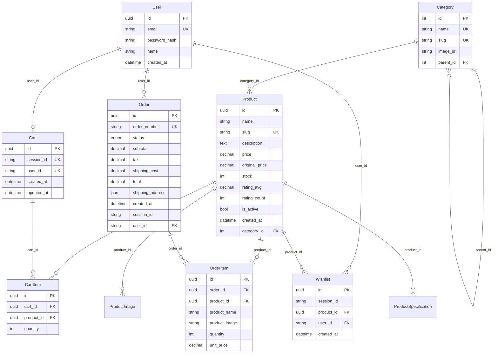

# Database Design

PostgreSQL via Prisma. Schema source of truth: `backend/prisma/schema.prisma`.

**Local:** Docker Compose (`amazon_db`)  
**Production:** Neon (connection string in `DATABASE_URL`)

## ER diagram



## Tables

| Table | Purpose |
|-------|---------|
| `users` | Auth (not wired in UI yet) |
| `categories` | Catalog grouping; optional `parent_id` for one level of nesting |
| `products` | Core catalog row |
| `product_images` | Multiple images per product; one marked `is_primary` |
| `product_specifications` | Key/value specs on PDP |
| `carts` | One cart per `session_id` **or** `user_id` |
| `cart_items` | Line items; unique per `(cart_id, product_id)` |
| `orders` | Placed orders with pricing snapshot |
| `order_items` | Line items with name/price snapshot at order time |
| `wishlists` | Saved products per session; unique per `(session_id, product_id)` |

## Session vs user identity

MVP uses the `amazon_session_id` cookie — no login.

| Table | Guest (now) | Authenticated (future) |
|-------|-------------|------------------------|
| `carts` | `session_id` (unique) | `user_id` (unique) |
| `orders` | `session_id` indexed | `user_id` optional FK |
| `wishlists` | `session_id` required | `user_id` optional FK |

When auth ships: attach `user_id` on login and optionally merge session cart/wishlist into the user record.

## Key relationships

- **Product → Category** — many-to-one (`category_id`)
- **Product → images/specs** — one-to-many, cascade delete
- **Cart → CartItem → Product** — cart is the parent; deleting cart removes items
- **Order → OrderItem** — order stores **snapshots** (`product_name`, `unit_price`) so history stays correct if catalog changes
- **Wishlist → Product** — many-to-one; same product can't be saved twice per session

## Indexes

| Table | Index | Why |
|-------|-------|-----|
| `products` | `category_id` | Filter by category on home |
| `products` | `slug`, `name` | Lookup + search |
| `cart_items` | `cart_id` | Load cart lines |
| `cart_items` | unique `(cart_id, product_id)` | One row per product in cart |
| `orders` | `session_id`, `user_id` | Order history queries |
| `order_items` | `order_id` | Load order lines |
| `wishlists` | `session_id` | List wishlist for session |
| `wishlists` | unique `(session_id, product_id)` | No duplicate saves |

## Order status enum

`pending` · `confirmed` · `shipped` · `delivered` · `cancelled`  
New orders default to `confirmed`.

## Seed

Script: `backend/prisma/seed.ts`

1. Fetches categories + products from [DummyJSON](https://dummyjson.com)
2. Converts USD prices × 83 → INR
3. Maps DummyJSON categories to `categories` rows
4. Creates products with images, specs (from product metadata), and stock

```bash
pnpm run prisma:migrate   # or prisma:migrate:prod in CI/prod
pnpm run prisma:seed      # idempotent reset + re-seed
```

**~194 products** across categories like smartphones, laptops, fragrances, etc.

## Migrations

| Migration | What |
|-----------|------|
| `20260612133144_amazon_data` | Initial schema + seed tables |
| `20260613120000_wishlist_session` | Wishlist `session_id`, optional `user_id` |

Commands:

```bash
pnpm run prisma:migrate      # dev (creates migration)
pnpm run prisma:migrate:prod # deploy migrations (CI / production)
pnpm run prisma:studio         # browse data
```

## Files

| Path | Role |
|------|------|
| `backend/prisma/schema.prisma` | Models + indexes |
| `backend/prisma/migrations/` | SQL migration history |
| `backend/prisma/seed.ts` | DummyJSON import |
| `backend/src/services/*.ts` | All DB access (Prisma only here) |
